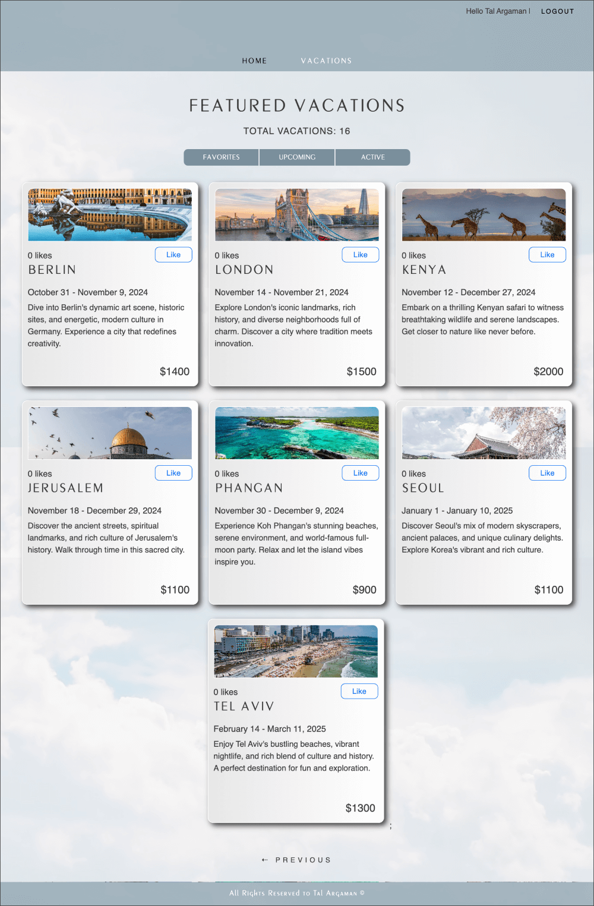

## Vacation Provocation (Full-stack):

Sign up for the app to explore a variety of vacation options. Once registered, you can sort through vacations, highlight your favorites, and view upcoming trips.
If you have admin privileges, you'll also be able to add, edit, or remove vacations and monitor follower statistics for each vacation by user.
 Frontend version: https://toulouse6.github.io/vacation-prov-frontend/

**Admin Credentials:**
- **Email:** meetollie@gmail.com
- **Password:** 12345678

---

**Technologies Used:**

- **Angular17**
- **TypeScript**
- **CSS3**
- **HTML5**

- **Node.js**
- **Express.js**

- **MySQL**

- **Docker**

---

**Author**: Tal Argaman
